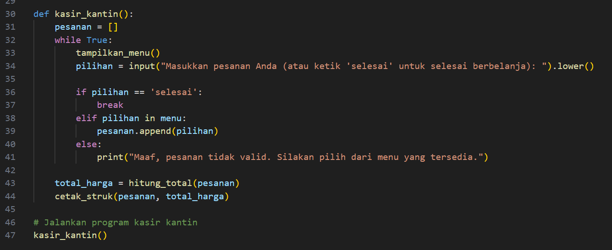

## Profil
| Variable | Isi |
| -------- | --- |
| *Nama* | Laras sakti |
| *NIM* | 312310627 |
| *Kelas* | TI.23.A6 |
| *Mata Kuliah* | Bahasa Pemrograman |
| *Link vidio Penjelasan* |https://youtu.be/4P2VcOvlAEU?si=3K-LVYjsFfhyZZy1  |

# Program sebuah kasir sederhana untuk kantin. Fungsi-fungsi yang ada di dalamnya meliputi:

1. tampilkan_menu(): Untuk menampilkan daftar menu beserta harganya.
2. hitung_total(pesanan): Untuk menghitung total harga dari pesanan yang dibuat.
3. cetak_struk(pesanan, total_harga): Untuk mencetak struk pembelian berdasarkan pesanan yang diberikan dan total harganya.
4. kasir_kantin(): Merupakan fungsi utama yang menjalankan logika kasir. Pengguna akan diminta untuk memilih pesanan, dan ketika selesai, struk pembelian akan dicetak.

   
   
   

